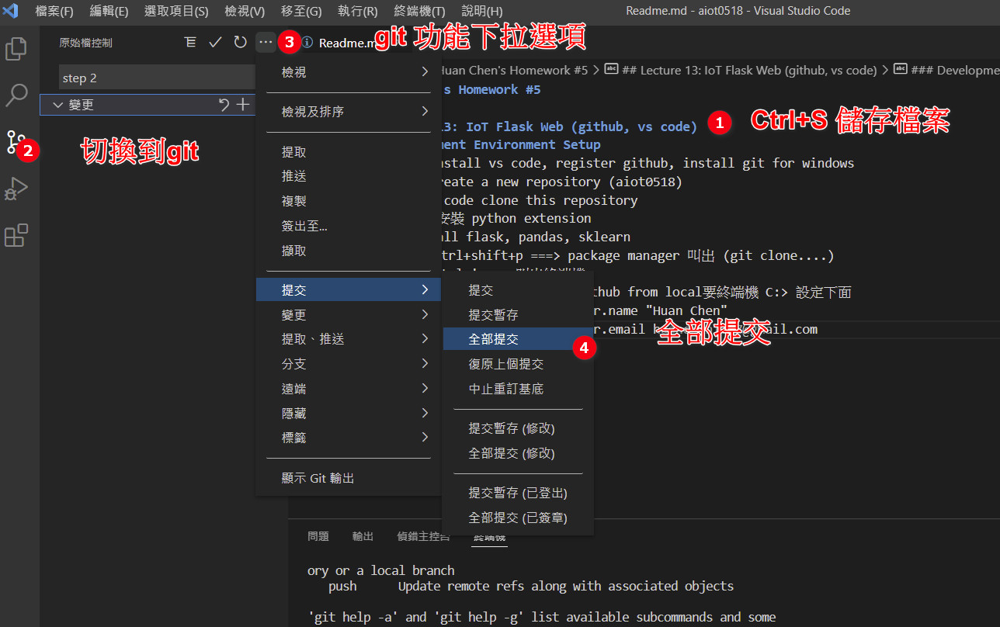

# natemc0937's Homework #5 - 葉永興 V2

## Lecture 13: IoT Flask Web (github, vs code)
### Development Environment Setup
1. Please install vs code, register github, install git for windows
2. github create a new repository (aiot0518)
3. go to vs code clone this repository  
4. vs code 安裝 python extension 
5. pip install flask, pandas, sklearn 
   $git config --global user.name "natemc0937"
   $git config --global user.email "natemc0937@gmail.com"
  * 快捷鍵 ctrl+shift+p ===> package manager 叫出 (git clone....)
  * 快捷鍵 ctrl+' ==> 叫出終端機 
  

 ### Flask Web Development 

1. (check-point 3) simple flask web
 * return 'hello world'
 * retun "<h1>Hello World big font</h1>"
 * return return app.send_static_file('index.html')  ==> remeber to create static/index.html